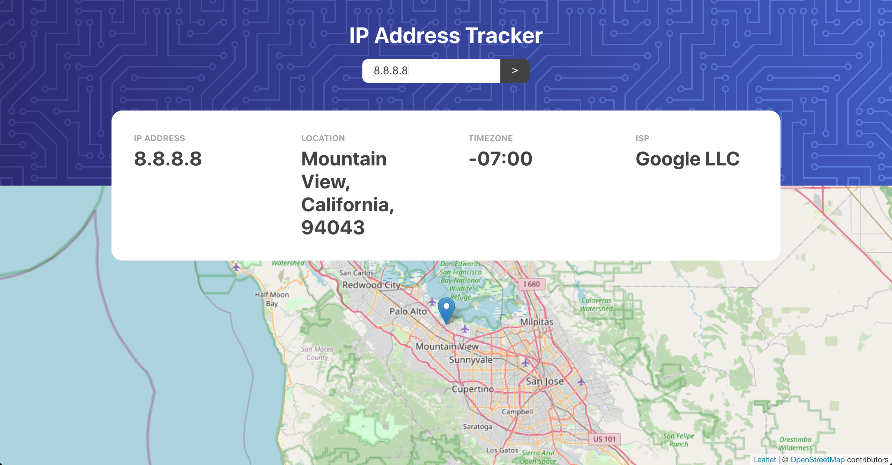

# IP Address Tracker

Find out where an IP address is from! I found this idea at Frontend Mentor as a [challege](https://www.frontendmentor.io/challenges/ip-address-tracker-I8-0yYAH0) and decided it would be a quick project to get up and running.

This project was bootstrapped with [Create React App](https://github.com/facebook/create-react-app).

## Installing

You can clone this repo and then run `yarn install` inside the project's folder.

## Using the application

In the project directory, you can run:

### `yarn start`

Runs the app in the development mode. 
Open [http://localhost:3000](http://localhost:3000) to view it in the browser.

### `yarn test`

Launches the test runner in the interactive watch mode. 

### `yarn build`

Builds the app for production to the `build` folder. 
It correctly bundles React in production mode and optimizes the build for the best performance.

## Contact

If you want to contact me you can reach me at <dwbwill@gmail.com>.

## License

This project uses the following license: [MIT](LICENSE.md).